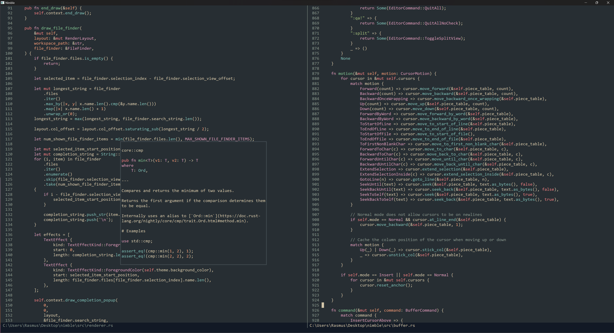

# Nimble
Nimble is modal (vim-like) editor written in Rust. Feel free to try it out :)

## Features
- Vim-like movement, motions and editing
- Multiple cursors
- LSP support, featuring auto-completion, signature help, hover info and commands (goto definition etc.)
- Syntax highlighting with [Syntect](https://github.com/trishume/syntect) 

## Screenshot

## Warning
- I have developed Nimble to fit my personal workflow, it has *no* customization of keybindings, colorschemes etc.

## Keybindings
- "Escape" - Enter normal mode
- "i" - Enter insert mode at character
- "I" - Enter insert mode at first non-blank character
- "a" - Enter insert mode after character
- "A" - Enter insert mode at end of line
- "o" - Insert new line and enter insert mode line
- "O" - Insert new line above and enter insert mode line
- "v" - Enter visual mode
- "V" - Enter visual line mode
- "hjkl" - Movement by character
- "w" - Move forward by word
- "b" - Move backward by word
- "^" - Move to first non-blank character
- "$" - Move to end of line
- "gg" - Move to start of file
- "G" - Move to end of file
- "f" - Go to character forward (inclusive)
- "F" - Go to character backward (inclusive)
- "t" - Go to character forward (exclusive)
- "T" - Go to character backward (exclusive)
- "rX" - Replace character with X
- "ciX" - Change inside (X = bracket character)
- "diX" - Delete inside (X = bracket character)
- "ctX" - Change to (X = bracket character) (inclusive)
- "dtX" - Delete to (X = bracket character) (inclusive)
- "cTX" - Change to (X = bracket character) (exclusive)
- "dTX" - Delete to (X = bracket character) (exclusive)
- "x" - Cut
- "dd" - Delete line
- "D" - Delete rest of line
- "J" - Insert new cursor below
- "K" - Insert new cursor above
- "u" - Undo
- "Ctrl + R" - Redo
- ">" - Indent
- "<" - Unindent
- "p" - Paste from System clipboard
- "P" - Paste from cursor clipboard(s)
- "yy" - Copy line
- "zz" - Center view
- "/" - Find in file (search)
- "n" - Go to next search result
- "N" - Go to previous search result
- "gd" - Go to definition (LSP)
- "gi" - Go to implementation (LSP)
- "Ctrl + Space" - Manually trigger completion
- "Ctrl + T" - Toggle split view
- "Ctrl + C" - Toggle light/dark colorscheme
- "." - Repeat last command
- ":COMMAND" - supported commands are:
    - ":w" - Save to file
    - ":wq" - Save to file and quit
    - ":q" or ":bd" - Quit
    - ":q!" or ":bd!" - Quit without checking to save
    - ":qa" - Quit all open documents
    - ":qa!" - Quit all open documents without checking to save
    - ":split" - Toggle split view

